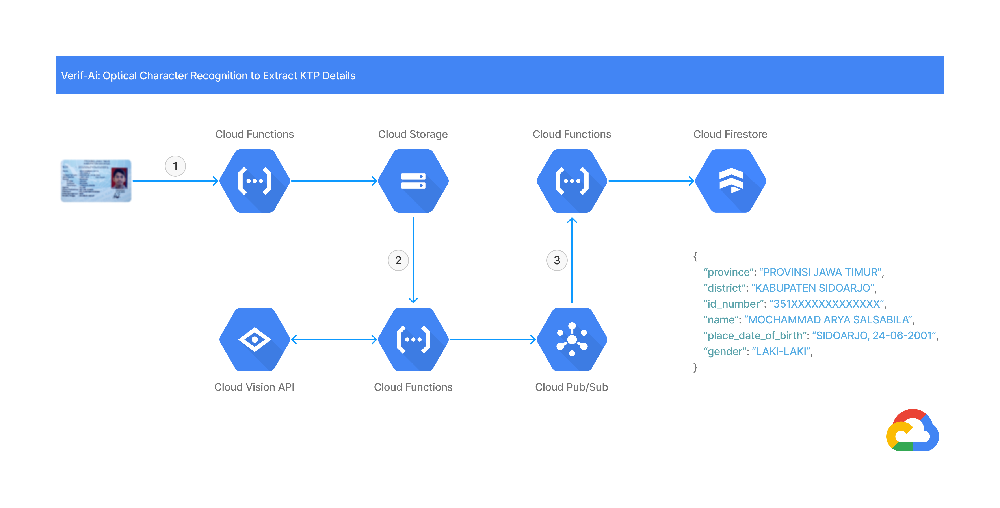

## VerifAI

Optical Character Recognition (OCR) to extract information on Indonesian Identity Card (KTP) using Google Cloud Platform.

## Architecture



The data flow in the application involves several steps:
1. Upload photo via HTTP request. A Cloud Function is triggered, which uses the OpenCV to apply threshold on photo and upload it to Cloud Storage.

2. A Cloud Function uses the Cloud Vision API to extract the text from photo. Text is sent to the result queue by publishing a message to a Pub/Sub topic.

3. Another Cloud Function will collect details from the text in the result queue. Save the collected details from the result queue to Cloud Firestore.

## Deployment

Pre-requisites:

1. Google Cloud Platform account.
2. Create a Google Cloud project.
3. Make sure that billing is enabled for your Cloud project.

Preparing the application:

1. Enable Cloud Build, Cloud Functions, Cloud Pub/Sub, Cloud Storage, and Cloud Vision APIs.

    ```shell
    gcloud services enable \
      cloudbuild.googleapis.com \
      cloudfunctions.googleapis.com \
      pubsub.googleapis.com \
      storage.googleapis.com \
      vision.googleapis.com
    ```

2. Create a Cloud Storage bucket to upload images.

    ```shell
    gsutil mb gs://YOUR_TRIGGER_BUCKET_NAME
    ```

3. Create a Pub/Sub topics to publish the finished extraction results.

    ```shell
    gcloud pubsub topics create YOUR_RESULT_TOPIC_NAME
    ```

4. Clone this repository.

    ```shell
    https://github.com/arryaaas/verifai.git
    ```

Deploying the functions:

1. Deploy the upload function with a HTTP trigger.

    ```shell
    cd ~/verifai/upload
    gcloud functions deploy verifai-upload \
      --runtime python39 \
      --trigger-http \
      --entry-point parse_multipart \
      --allow-unauthenticated \
      --set-env-vars BUCKET_NAME=YOUR_TRIGGER_BUCKET_NAME
    ```

2. Deploy the extract function with a Cloud Storage trigger.

    ```shell
    cd ~/verifai/extract
    gcloud functions deploy verifai-extract \
      --runtime python39 \
      --trigger-resource YOUR_TRIGGER_BUCKET_NAME \
      --trigger-event google.storage.object.finalize \
      --entry-point process_image \
      --set-env-vars GCP_PROJECT=YOUR_GCRP_PROJECT_ID,RESULT_TOPIC=YOUR_RESULT_TOPIC_NAME
    ```

3. Deploy the collect function with a Cloud Pub/Sub trigger.

    ```shell
    cd ~/verifai/collect
    gcloud functions deploy verifai-collect \
      --runtime python39 \
      --trigger-topic YOUR_RESULT_TOPIC_NAME \
      --entry-point process_message
    ```

## License

Distributed under the MIT License. See `LICENSE` for more information.

## Contact

Mochammad Arya Salsabila - Aryasalsabila789@gmail.com